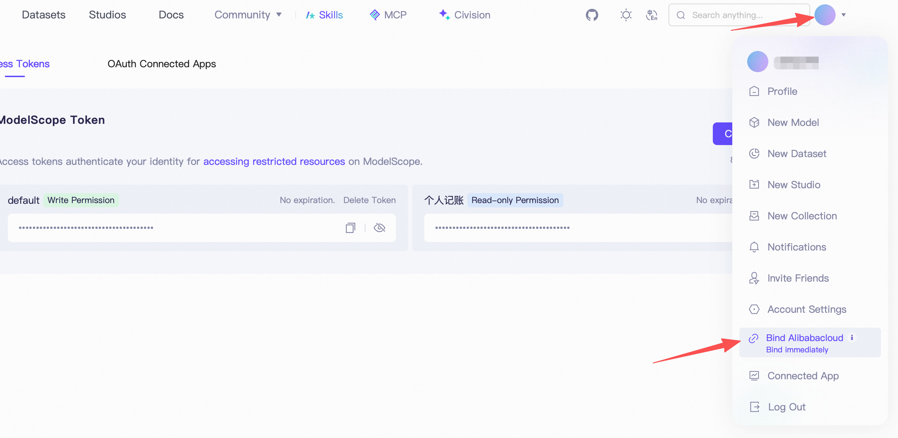
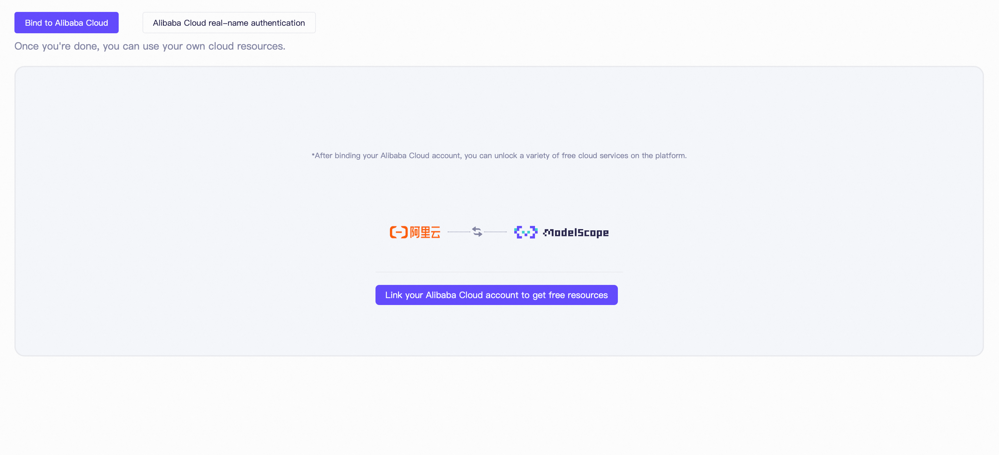
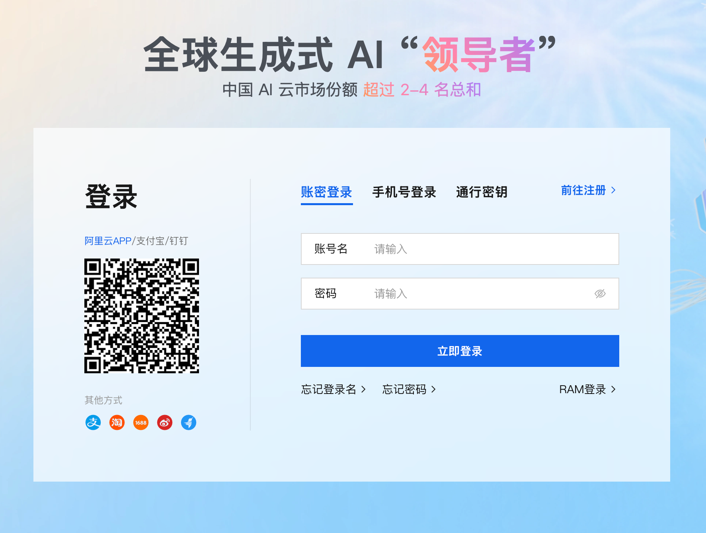
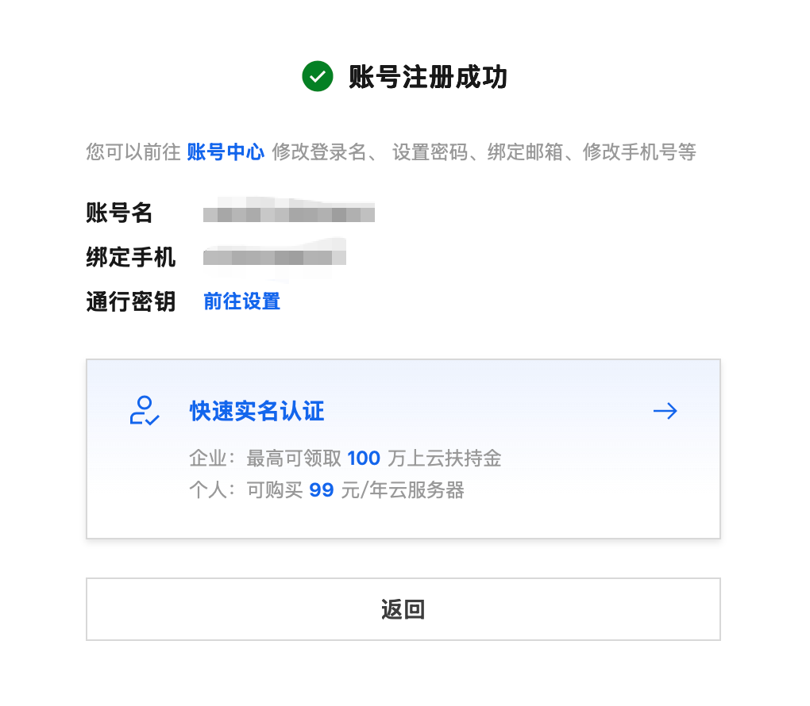
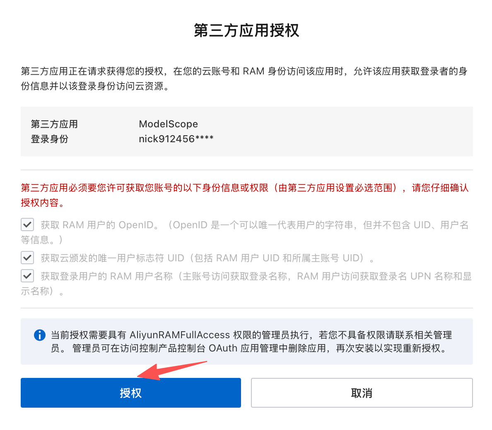
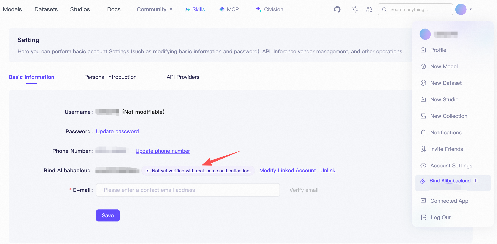
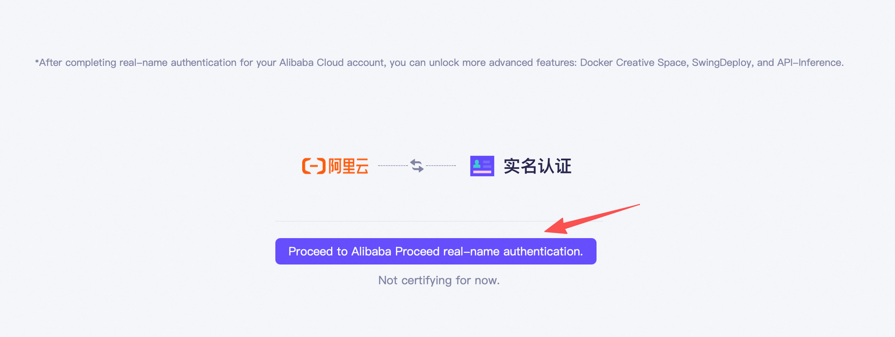
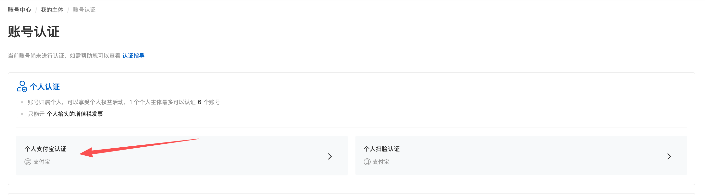

# 如何申请免费的 ModelScope（魔搭）大模型额度

本 App 的「AI 智能记账」走 OpenAI 兼容接口，默认接 **ModelScope（魔搭社区）** 的免费模型推理服务。
魔搭对**绑定阿里云账号并完成实名认证**的用户提供**每天约 2000 次**的免费 API 调用，足够日常一句话记账。

> 一句话流程：注册魔搭 → 绑定阿里云账号 → 阿里云实名认证 → 复制访问令牌填进 App。
> 没绑定/没实名时调用接口会报：`401 please bind your alibaba cloud account before use`。

---

## 0. 注册 / 登录 ModelScope

打开 [https://modelscope.cn](https://modelscope.cn)，用手机号或 GitHub 等方式注册并登录。

---

## 1. 进入「绑定阿里云账号」入口

登录后点**右上角头像**，在下拉菜单里点 **Bind Alibabacloud（绑定阿里云）**。

> 顺便记住：这个页面的 **Access Tokens** 列表（`default` 那条 *Write Permission*）就是第 6 步要复制的 API Key。

---

## 2. 发起绑定

在绑定页点 **Link your Alibaba Cloud account to get free resources**（关联阿里云账号领取免费资源）。

---

## 3. 登录 / 注册阿里云账号

已有阿里云账号直接登录；没有就点**前往注册**，免费注册一个。

注册成功后会看到账号信息页：

---

## 4. 授权 ModelScope 访问

阿里云会弹出**第三方应用授权**页（申请方为 ModelScope），点 **授权**。

---

## 5. 完成阿里云实名认证（开通 API 额度的前提）

绑定后回到 ModelScope 设置页，如果 **Bind Alibabacloud** 旁显示 *Not yet verified with real-name authentication（尚未实名认证）*，必须先实名，免费 API 推理额度才会开通。

点进去前往阿里云实名认证：

在账号认证页选 **个人认证 → 个人支付宝认证**（或个人扫脸认证），按提示完成即可。

---

## 6. 复制访问令牌（Access Token）= API Key

实名完成后，回到 ModelScope 的 **访问令牌（Access Tokens）** 页面（即第 1 步那个页面），
复制 `default` 那条 **Write Permission** 的令牌（形如 `ms-xxxxxxxx...`）。

> ⚠️ 令牌等同密码，不要截图公开、不要提交到代码仓库。

---

## 7. 选模型并在 App 里配置

在魔搭「模型库」挑一个支持 API 推理的对话模型，复制它的**完整模型 ID（带命名空间前缀）**，例如
`Qwen/Qwen3-30B-A3B-Instruct-2507`。

然后打开 App → **我的 → AI 智能记账 → 新增 / 编辑配置**，按下表填：

| 字段 | 值 |
| --- | --- |
| 来源（Base URL） | `https://api-inference.modelscope.cn/v1` |
| API Key | 第 6 步复制的 `ms-...` 令牌 |
| 模型（Model） | 完整模型 ID，如 `Qwen/Qwen3-30B-A3B-Instruct-2507` |

保存后回记账页输入「今天打车35」点**识别**，能自动出账即配置成功。

---

## 常见报错对照

| 报错 | 原因 | 解决 |
| --- | --- | --- |
| `401 please bind your alibaba cloud account before use` | 没绑定阿里云账号 / 未实名 | 完成第 1–5 步 |
| `401` / `Invalid token` | api key 填错或过期 | 重新复制第 6 步的令牌 |
| `400` 模型不存在 | 模型 ID 没带前缀 / 拼错 | 用完整 repo id（如 `Qwen/...`） |
| `429` 调用太频繁 | 触发限流 | 稍等重试，或换一条配置/模型 |

---

## 额度说明

- 绑定阿里云 + 实名后，每天约 **2000 次**免费调用，每天刷新。
- 不够用时可在 App 里多加几条不同来源/模型的配置轮换使用。
